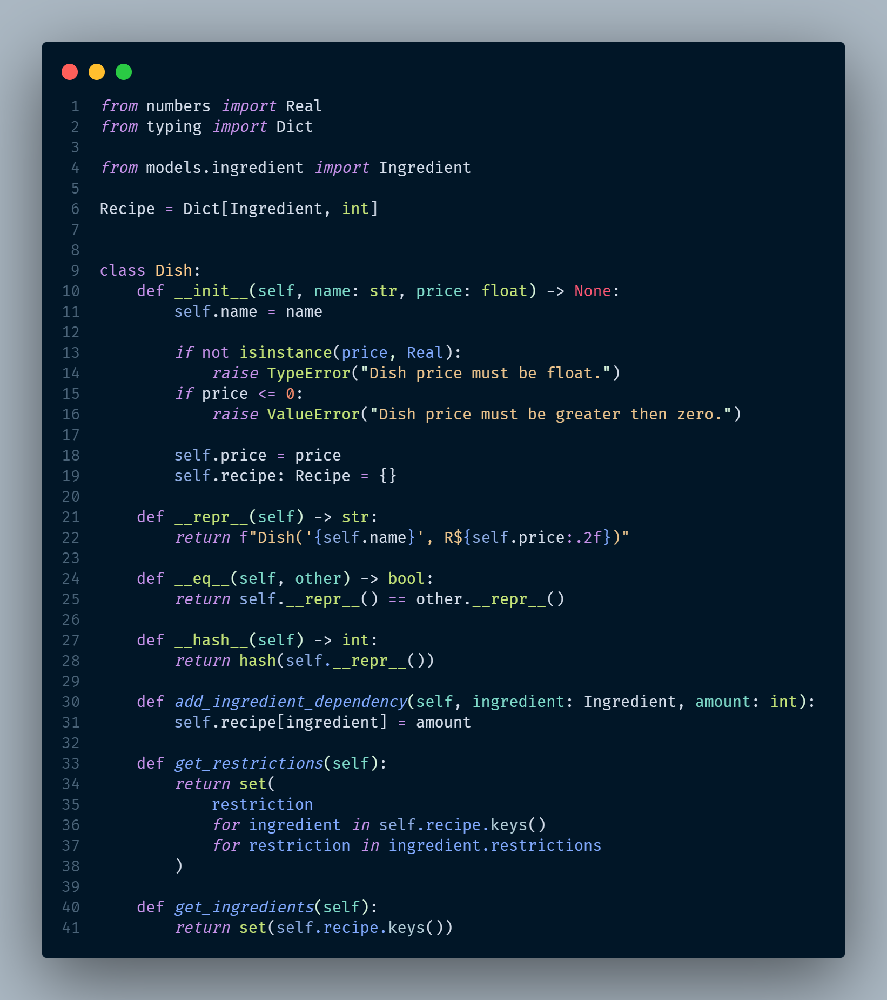
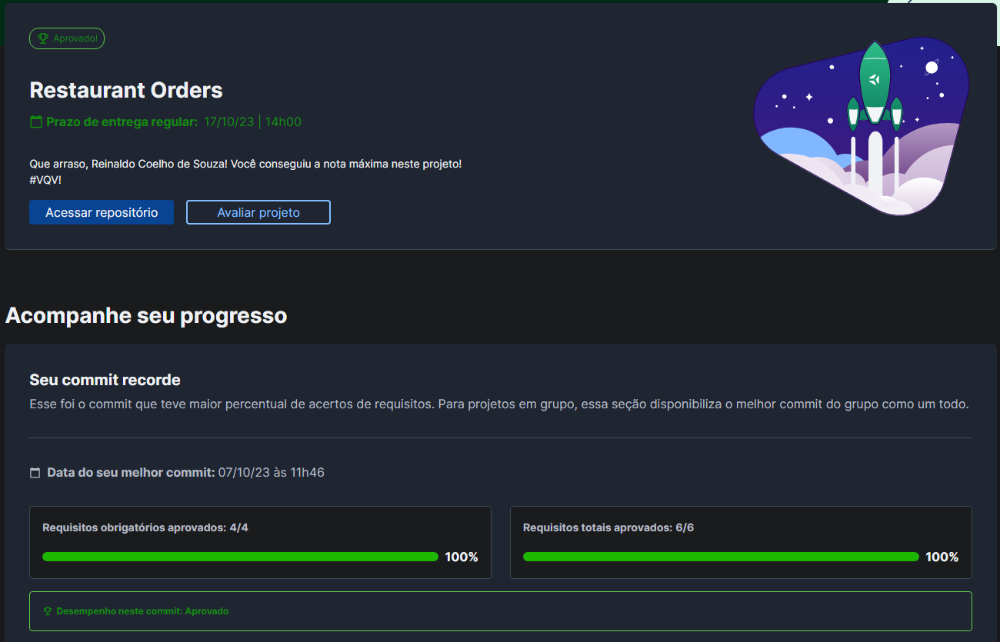

# 🍖 Restaurant Orders



## 📘 Sobre

Implementação de estruturas de dados como Hashmap (usando Dict e Set em Python), manipulação de dados, realização de testes e aplicação de conceitos de orientação a objetos para desenvolver uma ferramenta de construção de cardápios para um restaurante.

## ⚛️ Ferramentas

- Python
- Pytest
- Algoritmos de busca e ordenação
- Pilhas e Filas
- Hasmap, Dict e Set
- P.O.O

## 🛠️ Como executar o projeto?

1. criar o ambiente virtual
```python3 -m venv .venv```
2. ativar o ambiente virtual
```source .venv/bin/activate```
3. instalar as dependências no ambiente virtual
```python3 -m pip install -r dev-requirements.txt```
4. rodar o servidor
```python3 -m uvicorn app:app```
5. acesse a rota "/docs" para ver a documentação gerada pelo FastAPI

## 📝 Nota


